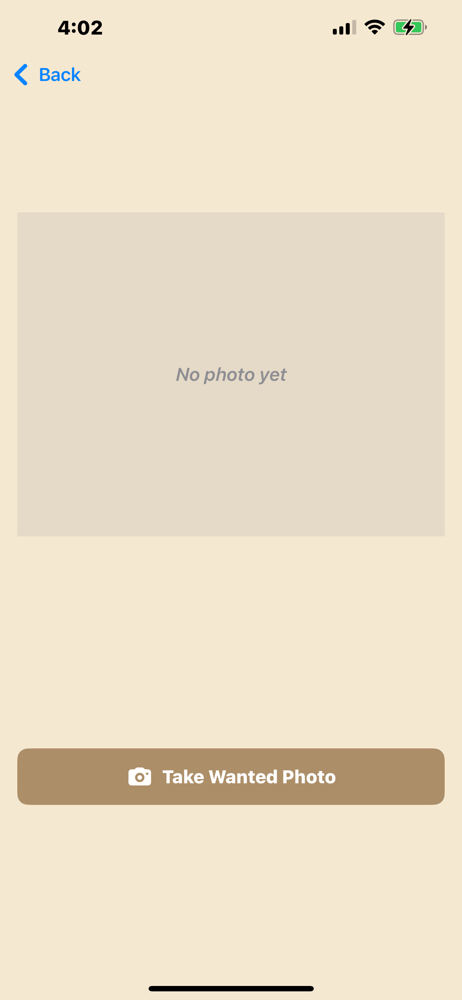
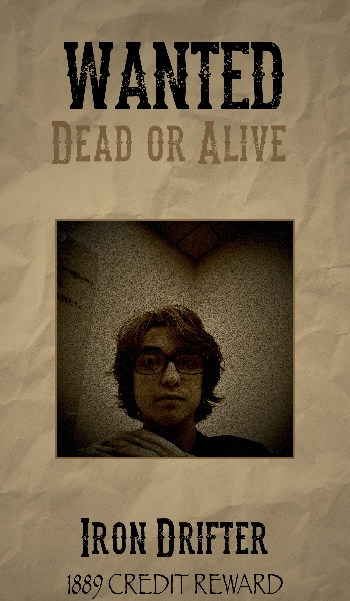

# 🌌⭐ Star-Wanted
### _A Space-Cowboy Photo Experience_

**Star-Wanted** is a SwiftUI iPhone app built for a hackathon project that blends the grit of the Old West with the style of outer space.  
Take a picture, transform it into a “Wanted” poster, and join the cosmic bounty hunt! 🤠🪐

---

## 🚀 Features

-📸 Camera Integration
Capture a photo directly from your iPhone’s camera.

-🖼️ Dynamic Wanted Poster Generator
Your photo is automatically framed in a vintage-style poster with custom name and reward text.

-🎨 Old-West Filters & Textures
Realistic sepia tones, paper textures, and lighting effects make your poster feel authentically aged.

-🪙 Random Outlaw Identity System
Each photo is paired with a randomly generated outlaw name and bounty in Galactic Credits.

-💾 Poster Saving System
Tap “Save Poster to Photos” to export your finished bounty poster straight into your iPhone’s photo library — proof of your intergalactic outlaw status.

-🌟 Home Screen Navigation
A glowing star button welcomes players into the Wild West of space.
---

## 🧑‍💻 Built With

| Tool | Purpose |
|------|----------|
| **Swift / SwiftUI** | Core app UI and logic |
| **Xcode** | Development & simulation |
| **CoreImage** | Filter and photo effects |
| **UIKit** | Camera integration |
| **Git + GitHub** | Version control and collaboration |

---

## 🪶 Screenshots (Preview)

| Home Screen | Photo Screen | Saved Screen | Poster Example |
|--------------|----------------|--------------|----------------|
|  |  |  |  |

---

## 🔧 Installation

1. Clone the repository:
   ```bash
   git clone https://github.com/zanderbrysch/Star-Wanted.git
   cd Star-Wanted
   ```
2. Go to Xcode studio:
   ```
   open Star-Wanted.xcodeproj
   ```
   
   
   💡 Make sure to enable Camera permissions and Developer Mode on your device.
